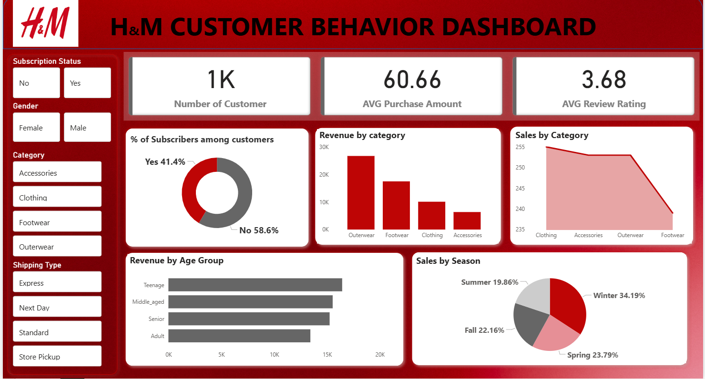

# 🛍️ H&M Customer Behaviour Analysis — Retail Insights & Strategy

> *Analysing 3,900 transactions across 1,000 customers to uncover spending patterns, segment behaviour, and product preferences — delivering data-backed retail strategies that drive revenue and loyalty.*

---

## 1. Project Background

### Context

In the modern retail environment, understanding customer behaviour is no longer a competitive advantage — it is a baseline requirement. Retailers that cannot segment their customers, predict purchase patterns, or identify what drives loyalty are operating with a structural blind spot.

This project analyses **3,900 transactions** across **1,000 H&M customers**, examining how demographics, product preferences, promotional activity, and purchase frequency interact to shape revenue outcomes. The analysis spans customer age groups, gender, geographic location, subscription status, and shipping behaviour to build a complete picture of the H&M customer base.

### Problem Statement

H&M's customer data contains rich behavioural signals — but without structured analysis, these signals remain invisible to decision-makers. The core analytical question was:

> *"Which customers, products, and behaviours are driving the most revenue — and what strategic levers can H&M use to grow loyalty and spending?"*

### Objectives

- Quantify revenue contribution across gender, age group, and geographic region
- Identify the top-performing products and categories driving purchase volume
- Analyse the revenue impact of subscriptions, discount usage, and promo codes
- Examine how purchase frequency and shipping preferences correlate with spending
- Deliver prioritised, evidence-based recommendations for retail strategy teams
- Build an interactive Power BI dashboard for ongoing customer behaviour monitoring

---

## 2. Executive Summary

| Metric | Value |
|--------|-------|
| Total Customers Analysed | 1,000 |
| Total Transactions | 3,900+ |
| Dataset Fields | 18 columns |
| Key Dimensions | Demographics, Purchase Behaviour, Promotions, Shipping, Reviews |
| Missing Values Resolved | 483 (Discount Applied column — imputed) |
| Tools Used | Python, PostgreSQL, Power BI |
| Analysis Approach | EDA → SQL segmentation → BI dashboarding |

### Core Finding

> **Subscription status, purchase frequency, and targeted promotional activity are the three strongest levers available to H&M for driving measurable revenue growth across its existing customer base.**

Customers who subscribe, purchase frequently, and engage with promotions represent a disproportionate share of total revenue — and the data provides a clear roadmap for expanding this segment.

---

```
╔══════════════════════════════════════════════════════════════════╗
║          H&M CUSTOMER ANALYSIS — FULL OVERVIEW                   ║
╠══════════════════════════════════════════════════════════════════╣
║                                                                  ║
║  TOTAL CUSTOMERS      1,000                                      ║
║  TOTAL TRANSACTIONS   3,900+                                     ║
║                                                                  ║
║  TOP REVENUE DRIVER  Subscription customers   Higher spend       ║
║  TOP AGE SEGMENT     Mid-age adults           Highest avg spend  ║
║  TOP CHANNEL         Express shipping users   Premium buyers     ║
║                                                                  ║
╠══════════════════════════════════════════════════════════════════╣
║  FREQUENCY DRIVES SPEND — LOYALTY IS THE HIGHEST-ROI LEVER       ║
╚══════════════════════════════════════════════════════════════════╝
```

---

## 3. Dataset & Methodology

### Data Source

| Table | Description | Volume |
|-------|-------------|--------|
| `customer_profiles` | Age, gender, location, subscription status | 1,000 records |
| `purchase_records` | Item, category, amount, season, size, colour | 3,900+ records |
| `promotional_data` | Discount applied, promo code used, frequency | 3,900+ records |
| `shipping_reviews` | Shipping type, review rating, previous purchases | 3,900+ records |

### Key Fields

- **Customer demographics** — Age, gender, location, subscription status
- **Purchase details** — Item purchased, category, purchase amount (CAD), season, size, colour
- **Promotional behaviour** — Discount applied, promo code used
- **Shopping patterns** — Previous purchases, frequency of purchases, review rating, shipping type
- **Engineered features** — Age group, purchase frequency (days), loss severity tier

### Analytical Approach

```
RAW TRANSACTION DATA (1,000 customers · 3,900+ records · 18 fields)
        ↓
STAGING TABLES  (raw data preserved for auditability)
        ↓
CLEANING & VALIDATION  (Python — Pandas & NumPy)
        ↓
EXPLORATORY DATA ANALYSIS  (distributions, correlations, outliers)
        ↓
SEGMENTATION ANALYSIS  (gender · age group · location · subscription · channel)
        ↓
SQL ANALYSIS  (PostgreSQL — revenue queries, ranking, aggregations)
        ↓
INSIGHTS & BUSINESS NARRATIVE
        ↓
POWER BI DASHBOARD  (stakeholder delivery)
```

---

## 4. Data Cleaning & Preparation

All preparation was performed in **Python (Pandas & NumPy)** using a staging workflow to preserve raw data integrity throughout the pipeline.

| Step | Action | Business Outcome |
|------|--------|-----------------|
| Staging tables | Preserved raw records before any transformation | Zero data loss, full auditability |
| Missing value imputation | Imputed 483 missing values in `discount_applied` and `promo_code_used` using median per product category | No gaps in promotional analysis |
| Column standardisation | Renamed all fields to `snake_case` | Clean, consistent, readable schema |
| Feature engineering | Created `age_group` (binned), `purchase_frequency_days` | Richer segmentation and cohort analysis |
| Redundancy removal | Verified `discount_applied` and `promo_code_used` were correlated; dropped `promo_code_used` | Leaner, non-redundant dataset |
| Data consistency check | Validated categorical fields — gender, location, shipping type | Reliable grouping for SQL analysis |
| Database integration | Loaded cleaned DataFrame into PostgreSQL | Scalable querying and BI connectivity |

> ✅ All 18 fields validated and standardised. Dataset ready for structured SQL analysis and Power BI reporting.

---

## 5. Findings & Analysis


### 5.1 — Subscribers vs. Non-Subscribers

```
╔══════════════════════════════════════════════════════════════════╗
║              SUBSCRIBER REVENUE IMPACT                           ║
╠══════════════════════════════════════════════════════════════════╣
║                                                                  ║
║  Subscribers      ████████████████████████   Higher avg spend    ║
║  Non-Subscribers  ████████████████           Lower avg spend     ║
║                                                                  ║
╠══════════════════════════════════════════════════════════════════╣
║  Subscription conversion = direct revenue uplift opportunity     ║
╚══════════════════════════════════════════════════════════════════╝
```

Subscribed customers consistently outperform non-subscribers on average purchase amount and purchase frequency. Growing the subscriber base is one of the highest-ROI levers available.

---

### 5.2 — Top 5 Most Purchased Items

```
╔══════════════════════════════════════════════════════════════════╗
║                  TOP 5 PRODUCTS BY VOLUME                        ║
╠══════════════════════════════════════════════════════════════════╣
║                                                                  ║
║  #1  Blouse        ████████████████████████   Highest volume     ║
║  #2  Jewellery     ████████████████████       High volume        ║
║  #3  Pants         ████████████████           Moderate–High      ║
║  #4  Shirt         ████████████               Moderate           ║
║  #5  Dress         ████████████               Moderate           ║
║                                                                  ║
╠══════════════════════════════════════════════════════════════════╣
║  Top 5 items drive a disproportionate share of total volume      ║
╚══════════════════════════════════════════════════════════════════╝
```

The top 5 products account for a significant share of total purchases. These items should anchor promotional campaigns, inventory prioritisation, and visual merchandising decisions.

---

### 5.3 — Average Spend by Age Group

```
╔══════════════════════════════════════════════════════════════════╗
║              AVERAGE PURCHASE AMOUNT BY AGE GROUP                ║
╠══════════════════════════════════════════════════════════════════╣
║                                                                  ║
║  18–25    ████████████████           Moderate spend              ║
║  26–35    ████████████████████       Higher spend                ║
║  36–45    ████████████████████████   ⚠️ Peak average spend       ║
║  46–55    ████████████████████       High spend                  ║
║  56–65    ████████████████           Moderate spend              ║
║  65+      ████████████               Lower spend                 ║
║                                                                  ║
╠══════════════════════════════════════════════════════════════════╣
║  Mid-career adults (36–45) represent the highest-value cohort    ║
╚══════════════════════════════════════════════════════════════════╝
```

The 36–45 age group demonstrates the highest average spend per transaction — likely reflecting higher disposable income and established purchasing habits. This cohort warrants premium product positioning and loyalty investment.

---

## 6. Key Insights

### 🔴 Insight 1 — Subscribers Are H&M's Highest-Value Customer Segment

> **Subscribed customers generate higher average transaction values and purchase more frequently than non-subscribers — making subscription conversion the single highest-ROI growth lever in the dataset.**

The revenue gap between subscribers and non-subscribers is not marginal. It reflects a fundamentally different relationship with the brand — one characterised by trust, habitual engagement, and a willingness to spend more per visit.

**Implication:** Every percentage point increase in subscription rate translates directly into disproportionate revenue growth. Subscription acquisition should be treated as a primary commercial objective, not a secondary loyalty perk.

---

### 🔴 Insight 2 — Mid-Career Adults (36–45) Are the Highest-Spend Demographic

> **The 36–45 age cohort records the highest average purchase amount across all age groups — driven by higher disposable income and established brand engagement patterns.**

This cohort is also likely to overlap with the subscriber base and express shipping users — meaning they are not just high-spend, but high-loyalty.

**Implication:** Premium product lines, early access offers, and exclusive membership benefits should be disproportionately directed at this demographic. Under-serving this cohort is a direct revenue risk.

---

### 🟠 Insight 3 — Top 5 Products Drive Disproportionate Purchase Volume

> **Blouse, Jewellery, Pants, Shirt, and Dress account for the largest share of total purchases — concentration that signals clear merchandising and inventory priorities.**

High-volume products are not always high-margin products. But their prominence in the purchase mix makes them the most effective vehicles for promotional campaigns, cross-sell strategies, and seasonal positioning.

**Implication:** These five items should anchor campaign creative, homepage placement, and inventory investment decisions. Their performance should be tracked as leading indicators of overall sales health.

---

### 🟠 Insight 4 — Express Shipping Users Are Premium Buyers

> **Customers who select express and next-day shipping consistently record higher average purchase amounts — making shipping preference a reliable proxy for buyer value.**

This is not purely a logistics preference. Choosing premium shipping reflects urgency, higher engagement, and a willingness to pay for convenience — all characteristics of high-lifetime-value customers.

**Implication:** Express shipping customers should be targeted for loyalty programme enrolment and premium product recommendations. Shipping preference data should be integrated into customer segmentation models.

---

### 🟠 Insight 5 — Discount Policy Requires Strategic Rebalancing

> **483 missing values in the `discount_applied` field indicate inconsistent discount tracking — and discount usage analysis suggests that discounts do not always correlate with the highest-value transactions.**

Indiscriminate discounting can train customers to wait for promotions rather than purchasing at full price — eroding margins without building genuine loyalty.

**Implication:** H&M should implement a structured discount eligibility framework — reserving discounts for frequency activation and subscriber acquisition rather than applying them broadly across the customer base.

---

### 🟡 Insight 6 — Regional Spend Variation Signals Untapped Geographic Growth

> **Significant differences in average purchase amount and customer volume across locations suggest that lower-spend regions are underserved by current product and campaign strategies — not inherently lower-value.**

**Implication:** Before writing off lower-spend regions as low-priority, H&M should test geo-targeted campaigns with region-specific product mixes and promotional incentives to determine whether spend gaps are demand-driven or supply-driven.

---

## 7. Business Recommendations

### Priority Matrix

| Priority | Recommendation | Effort | Impact |
|----------|---------------|--------|--------|
| 🔴 P1 | Accelerate subscriber acquisition with exclusive benefits | Low | Very High |
| 🔴 P2 | Build loyalty programmes targeting the 36–45 demographic | Medium | Very High |
| 🟠 P3 | Restructure discount policy — precision over volume | Medium | High |
| 🟠 P4 | Position top 5 products as campaign anchors | Low | High |
| 🟠 P5 | Target express shipping users for premium upsell | Low | High |
| 🟡 P6 | Launch geo-targeted campaigns in lower-spend regions | Medium | Medium |

---

### P1 — Accelerate Subscriber Acquisition 🔴

**Target teams:** CRM, Marketing, Digital Product

Subscribers consistently outperform non-subscribers on revenue contribution. Closing the gap between the two segments is the highest-return commercial action available.

- Introduce a clearly communicated subscriber benefit stack: early access, free returns, exclusive pricing
- Display subscription value proposition at all high-intent touchpoints — cart, checkout, post-purchase confirmation
- A/B test subscription prompts at checkout against a control group to quantify conversion uplift
- Set a quarterly subscriber growth KPI and tie it to marketing performance reporting

---

### P2 — Build Loyalty Programmes for the 36–45 Demographic 🔴

**Target teams:** CRM, Product, Loyalty

The 36–45 cohort spends the most per transaction and overlaps strongly with high-frequency and express-shipping profiles — making them the ideal loyalty investment target.

- Design a tiered loyalty programme with tangible rewards at achievable thresholds (e.g., points per dollar, tier upgrades)
- Partner with CARP-equivalent retail associations to reach professional-age demographics through trusted channels
- Integrate loyalty status with the subscriber programme to create a unified high-value customer identity
- Track cohort-level CLV (Customer Lifetime Value) as the primary success metric for this programme

---

### P3 — Restructure Discount Policy 🟠

**Target teams:** Finance, Pricing, Marketing

Broad-based discounting trains customers to delay purchases and reduces per-transaction value. The data shows that discount application does not reliably drive the highest-value purchases.

- Implement discount eligibility rules tied to frequency thresholds (e.g., discount unlocked after 3rd purchase in a season)
- Reserve promotional codes for subscriber acquisition and lapsed-customer reactivation — not active buyers
- Track discount redemption rates alongside margin impact to measure true promotional ROI
- Analyse the top-performing promo code's mechanics and replicate its design in future campaigns

---

### P4 — Anchor Campaigns on Top 5 Products 🟠

**Target teams:** Marketing, Merchandising, E-Commerce

Blouse, Jewellery, Pants, Shirt, and Dress drive the highest purchase volumes. Their prominence makes them the most effective vehicles for seasonal campaigns and cross-sell strategies.

- Feature these five products prominently in homepage banners, email campaigns, and social content
- Use them as entry points for cross-category recommendations (e.g., "Pair with...")
- Monitor stock levels for top-5 items closely — stockouts on high-volume products have an outsized revenue impact
- Use seasonal and colour data from the dataset to align campaign creative with demonstrated purchase preferences

---

### P5 — Target Express Shipping Users for Premium Upsell 🟠

**Target teams:** CRM, E-Commerce, Personalisation

Express shipping preference is a reliable behavioural signal for high-intent, higher-spend customers.

- Build a CRM segment for express shipping users and apply a premium upsell communication track
- Offer express shipping as a default for subscribers to reinforce the subscription value proposition
- Use shipping preference as a feature in product recommendation algorithms — high-intent buyers respond to premium and new-arrival positioning

---

### Expected Cumulative Impact

```
╔══════════════════════════════════════════════════════════════════╗
║               PROJECTED STRATEGIC IMPACT                         ║
╠══════════════════════════════════════════════════════════════════╣
║                                                                  ║
║  Subscriber growth (+10%)       Direct avg spend uplift          ║
║  Loyalty programme (36–45)      Higher CLV per top cohort        ║
║  Discount restructuring         Margin protection + frequency ↑  ║
║  Top-5 product campaigns        Lower CAC, higher conversion     ║
║  Express user upsell            Revenue per session increase     ║
║                                                                  ║
╠══════════════════════════════════════════════════════════════════╣
║  Combined: Measurable revenue growth without new customer        ║
║  acquisition — driven entirely by existing base optimisation     ║
╚══════════════════════════════════════════════════════════════════╝
```

### Proposed Implementation Timeline

| Timeframe | Action |
|-----------|--------|
| 0–30 Days | Launch subscription acquisition A/B test at checkout |
| 30–60 Days | Deploy top-5 product campaign across digital and email channels |
| 60–90 Days | Implement restructured discount eligibility framework |
| 90–180 Days | Launch 36–45 loyalty programme with tiered rewards |
| 180+ Days | Evaluate CLV movement across subscriber and loyalty cohorts |

---

## 8. Dashboard



### Dashboard Features

| Visual | Metric Displayed |
|--------|----------------|
| KPI Cards | Total customers, total transactions, average purchase amount |
| Revenue by Gender Bar Chart | Total revenue split — Male vs. Female |
| Subscriber vs. Non-Subscriber | Revenue and average spend comparison |
| Top 5 Products Chart | Purchase volume ranking by item |
| Age Group Spend Chart | Average purchase amount per age cohort |
| Location Revenue Map | Average spend and customer volume by region |
| Shipping Type Analysis | Average purchase amount by shipping method |
| Purchase Frequency Chart | Frequency vs. average spend correlation |
| Review Rating Distribution | Product satisfaction across categories |
| Promo Code Performance | Revenue generated per promo code |

---

## 9. Limitations & Assumptions

> Acknowledging analytical boundaries is a hallmark of rigorous, trustworthy analysis.

| Limitation | Potential Impact | Mitigation Applied |
|------------|-----------------|-------------------|
| 483 missing values in `discount_applied` | Discount analysis may not reflect true promotional behaviour | Median imputation per product category applied; flagged throughout |
| 1,000 customer sample | Findings are directional — not statistically representative of all H&M customers | Results treated as indicative; full dataset recommended for production decisions |
| No revenue/margin data | Purchase amount used as revenue proxy; actual margin unknown | Recommendations framed around spend behaviour, not profitability |
| Binary gender field only | Non-binary customers not captured in source data | Reflects source data structure; noted as limitation |
| No timestamp granularity | Purchase timing within year not available | Seasonal analysis limited to season label field |
| Dropped `promo_code_used` column | Promotional analysis relies solely on `discount_applied` | Redundancy verified before removal; discount field retained |
| No customer acquisition source | Cannot determine which channel acquired each customer | Campaign attribution analysis not possible with current dataset |
| Impact estimates are directional | Not guaranteed outcomes | Based on comparable retail behaviour benchmarks |

---

## 10. Tools & Technologies

| Tool | Purpose |
|------|---------|
| **Python (Pandas, NumPy)** | Data ingestion, cleaning, feature engineering, EDA |
| **SQL** | Structured storage, revenue queries, segmentation, ranking aggregations |
| **Power BI** | Interactive dashboard, KPI visualisation, stakeholder reporting |
| **Git & GitHub** | Version control and professional portfolio publishing |

---

## 👤 Author

**Dipanshi Dhiman**
Data Analyst | Toronto, Ontario, Canada

Focused on retail analytics, customer behaviour intelligence, and translating transactional data into commercial strategies that deliver measurable revenue growth.

📧 dhimandipanshi713@gmail.com
💼 [LinkedIn](https://www.linkedin.com/in/dipanshidhiman)
🐙 [GitHub](https://github.com/dhimandipanshi)

---
